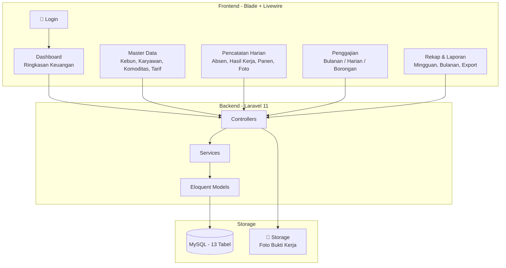
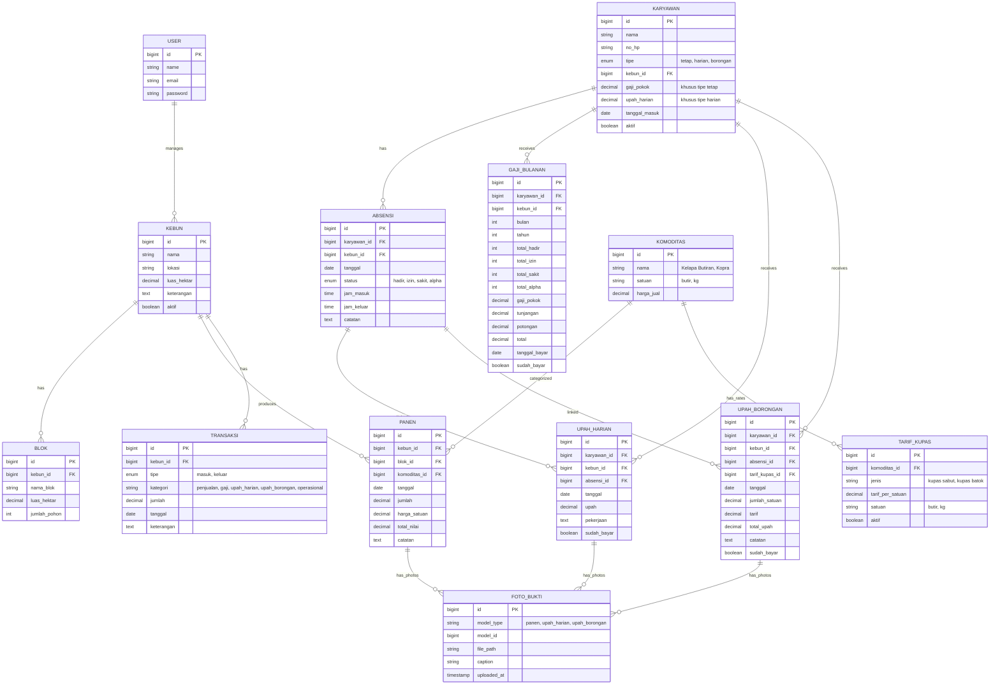
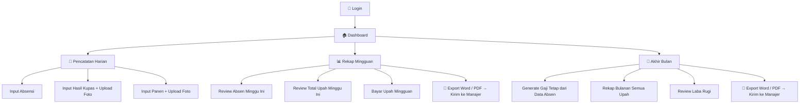

# Sistem Pencatatan Keuangan Perkebunan — Laravel Fullstack

Sistem pencatatan keuangan pribadi untuk supervisor perkebunan. Mencakup pencatatan hasil panen, absensi & hasil kerja harian, penggajian (bulanan, harian, borongan kupas kelapa), upload foto bukti kerja, rekap mingguan, serta export laporan ke Word & PDF untuk manajer.

> [!NOTE]
> **Single user** — Supervisor login via email & password. Tanpa multi-role.
> Default login: `admin@kebun.com` / `password`

## Arsitektur Sistem



## Entity Relationship Diagram



## Modul & Fitur

### 0. 🔐 Login
- Halaman login sederhana: email + password
- Default user: `admin@kebun.com` / `password`
- Session-based authentication (Laravel Breeze)
- Redirect ke dashboard setelah login

### 1. 🏠 Dashboard
- Total pemasukan & pengeluaran bulan ini
- Saldo per kebun
- Grafik tren panen 6 bulan terakhir
- Upah/gaji yang belum dibayar
- Ringkasan minggu ini (absen, hasil kupas, panen)

### 2. 📋 Master Data

| Menu | Keterangan |
|------|------------|
| **Kebun** | Nama, lokasi, luas. Tiap kebun bisa punya blok |
| **Karyawan** | Nama, tipe (tetap/harian/borongan), kebun, gaji pokok / upah harian |
| **Komoditas** | Jenis hasil (kelapa butiran, kopra, dll), satuan, harga jual |
| **Tarif Kupas** | Tarif per satuan kupas kelapa per jenis pekerjaan |

### 3. 📝 Pencatatan Harian

#### a) Absensi
- Input kehadiran harian per karyawan per kebun
- Status: hadir, izin, sakit, alpha
- Jam masuk & jam keluar (opsional)
- Data absensi menjadi **dasar perhitungan gaji**

#### b) Hasil Kerja Harian + Foto
- Input hasil kupas kelapa (borongan) per pekerja
- Input upah harian per pekerja
- **Upload foto bukti kerja** (foto dari WhatsApp bisa di-upload di sini)
- Setiap pencatatan bisa punya **banyak foto**

#### c) Pencatatan Panen
- Input hasil panen per kebun per blok
- Upload foto hasil panen
- Otomatis catat transaksi masuk

### 4. 💰 Penggajian

#### a) Gaji Bulanan — Karyawan Tetap
- Generate otomatis berdasarkan **data absensi bulan tersebut**
- Tampilkan: total hadir, izin, sakit, alpha
- Hitung: gaji pokok + tunjangan - potongan (berdasarkan absen)
- Tandai sudah bayar → catat transaksi keluar

#### b) Upah Harian — Pekerja Harian
- Dihitung dari absensi harian × tarif harian
- **Rekap mingguan**: total hari kerja × upah per hari
- Rekap bulanan
- Tandai sudah bayar per minggu/bulan

#### c) Upah Borongan — Kupas Kelapa Per Satuan
- Dihitung dari hasil kerja harian × tarif per satuan
- **Rekap mingguan**: total satuan × tarif
- Rekap bulanan
- Tandai sudah bayar per minggu/bulan

### 5. 📊 Rekap & Laporan

| Laporan | Detail |
|---------|--------|
| **Rekap Mingguan** | Rangkuman absen, hasil kerja, upah per minggu per kebun |
| **Rekap Bulanan** | Total panen, total gaji/upah, laba rugi per kebun |
| **Buku Kas** | Semua transaksi masuk/keluar per kebun |
| **Rekap Gaji** | Per karyawan, per tipe, per kebun, per periode |
| **Rekap Panen** | Per kebun, per komoditas, per periode |

#### Export Laporan (untuk Manajer)
- 📄 **Export ke Word (.docx)** — Format laporan formal dengan header, tabel, foto bukti
- 📋 **Export ke PDF** — Format ringkas untuk arsip
- Setiap laporan bisa di-export dan langsung dikirim ke manajer

---

## Tech Stack

| Layer | Teknologi |
|-------|-----------|
| **Framework** | Laravel 11 |
| **Frontend** | Blade + Livewire 3 + Alpine.js |
| **UI Template** | AdminLTE 4 (Bootstrap 5) |
| **Database** | MySQL 8 |
| **Charts** | ApexCharts |
| **Auth** | Laravel Breeze (login simple) |
| **PDF Export** | DomPDF |
| **Word Export** | PhpWord (phpoffice/phpword) |
| **Excel Export** | Laravel Excel (Maatwebsite) |
| **File Storage** | Laravel Storage (local disk) |
| **Image Handling** | Intervention Image (resize/compress foto) |

## Struktur Direktori

```
kebun-finance/
├── app/
│   ├── Http/Controllers/
│   │   ├── Auth/LoginController.php
│   │   ├── DashboardController.php
│   │   ├── KebunController.php
│   │   ├── KaryawanController.php
│   │   ├── KomoditasController.php
│   │   ├── TarifKupasController.php
│   │   ├── AbsensiController.php
│   │   ├── PanenController.php
│   │   ├── GajiBulananController.php
│   │   ├── UpahHarianController.php
│   │   ├── UpahBoronganController.php
│   │   ├── TransaksiController.php
│   │   ├── LaporanController.php
│   │   └── FotoBuktiController.php
│   ├── Models/
│   │   ├── User.php
│   │   ├── Kebun.php
│   │   ├── Blok.php
│   │   ├── Karyawan.php
│   │   ├── Komoditas.php
│   │   ├── TarifKupas.php
│   │   ├── Absensi.php
│   │   ├── Panen.php
│   │   ├── GajiBulanan.php
│   │   ├── UpahHarian.php
│   │   ├── UpahBorongan.php
│   │   ├── FotoBukti.php
│   │   └── Transaksi.php
│   ├── Services/
│   │   ├── AbsensiService.php
│   │   ├── GajiService.php
│   │   ├── PanenService.php
│   │   ├── LaporanService.php
│   │   └── ExportService.php
│   ├── Exports/
│   │   ├── RekapMingguanWord.php
│   │   ├── RekapBulananWord.php
│   │   ├── RekapGajiExport.php
│   │   ├── RekapPanenExport.php
│   │   └── BukuKasExport.php
│   └── Traits/
│       └── HasFotoBukti.php        → Polymorphic foto relation
├── database/
│   ├── migrations/                  → 13 migration files
│   └── seeders/
│       ├── UserSeeder.php           → Default login user
│       ├── KomoditasSeeder.php
│       └── KategoriSeeder.php
├── resources/views/
│   ├── auth/
│   │   └── login.blade.php         → Halaman login
│   ├── layouts/app.blade.php       → AdminLTE layout
│   ├── dashboard.blade.php
│   ├── kebun/                       → index, create, edit
│   ├── karyawan/                    → index, create, edit
│   ├── absensi/                     → index, input-harian
│   ├── panen/                       → index, create (+ upload foto)
│   ├── gaji/                        → index, generate, detail
│   ├── upah-harian/                 → index, input, rekap-mingguan
│   ├── upah-borongan/               → index, input (+ foto), rekap-mingguan
│   ├── transaksi/                   → buku-kas
│   └── laporan/
│       ├── rekap-mingguan.blade.php
│       ├── rekap-bulanan.blade.php
│       └── pdf/                     → PDF templates
├── routes/web.php
├── storage/app/foto-bukti/          → Upload foto dari WhatsApp
└── public/
```

## Alur Kerja Supervisor



## Contoh Tampilan Export Word

Laporan yang di-export ke Word akan berformat:

```
╔══════════════════════════════════════════════════╗
║  LAPORAN REKAP MINGGUAN PERKEBUNAN              ║
║  Kebun: Kebun Raya Utama                        ║
║  Periode: 10 Juni - 16 Juni 2026                ║
╠══════════════════════════════════════════════════╣
║                                                  ║
║  I. REKAP ABSENSI                               ║
║  ┌──────────────┬──────┬─────┬──────┬───────┐   ║
║  │ Nama         │Hadir │Izin │Sakit │ Alpha │   ║
║  ├──────────────┼──────┼─────┼──────┼───────┤   ║
║  │ Ahmad        │  6   │  0  │  0   │   0   │   ║
║  │ Budi         │  5   │  1  │  0   │   0   │   ║
║  └──────────────┴──────┴─────┴──────┴───────┘   ║
║                                                  ║
║  II. REKAP UPAH BORONGAN (KUPAS KELAPA)         ║
║  ┌──────────────┬────────┬───────┬──────────┐   ║
║  │ Nama         │Jumlah  │Tarif  │ Total    │   ║
║  ├──────────────┼────────┼───────┼──────────┤   ║
║  │ Ahmad        │500 btr │Rp 200 │Rp100.000 │   ║
║  │ Budi         │420 btr │Rp 200 │Rp 84.000 │   ║
║  └──────────────┴────────┴───────┴──────────┘   ║
║                                                  ║
║  III. FOTO BUKTI KERJA                          ║
║  [foto1.jpg] [foto2.jpg] [foto3.jpg]            ║
║                                                  ║
║  IV. REKAP PANEN                                ║
║  Total Kelapa: 2.500 butir (Rp 5.000.000)      ║
║                                                  ║
╚══════════════════════════════════════════════════╝
```
